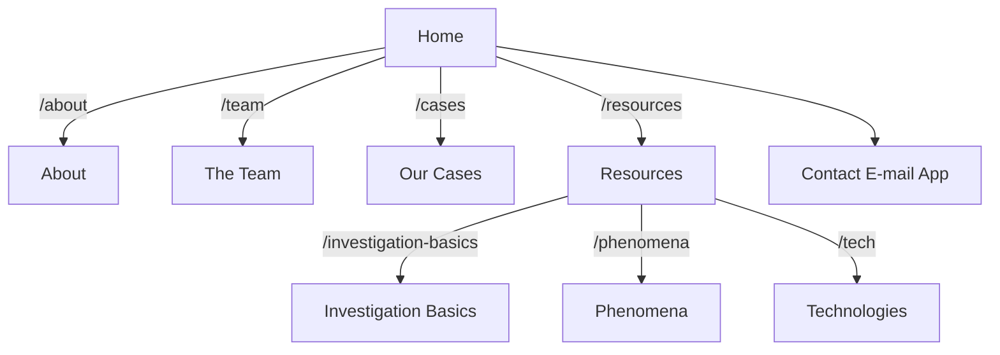
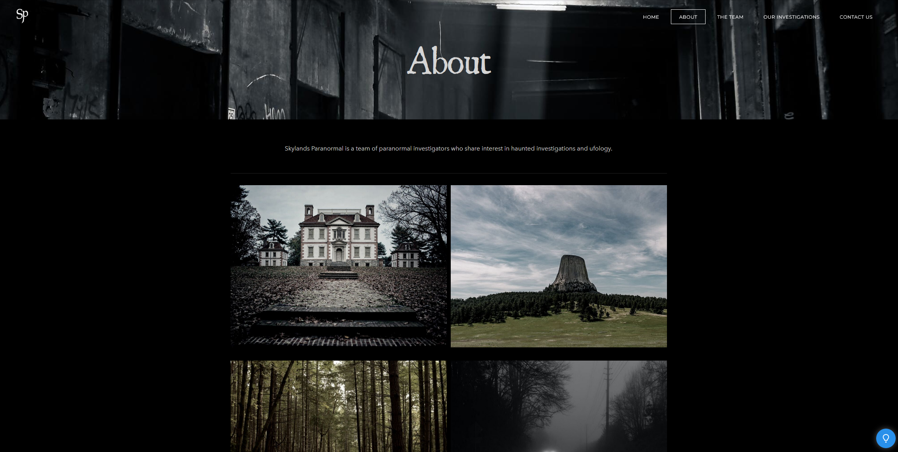
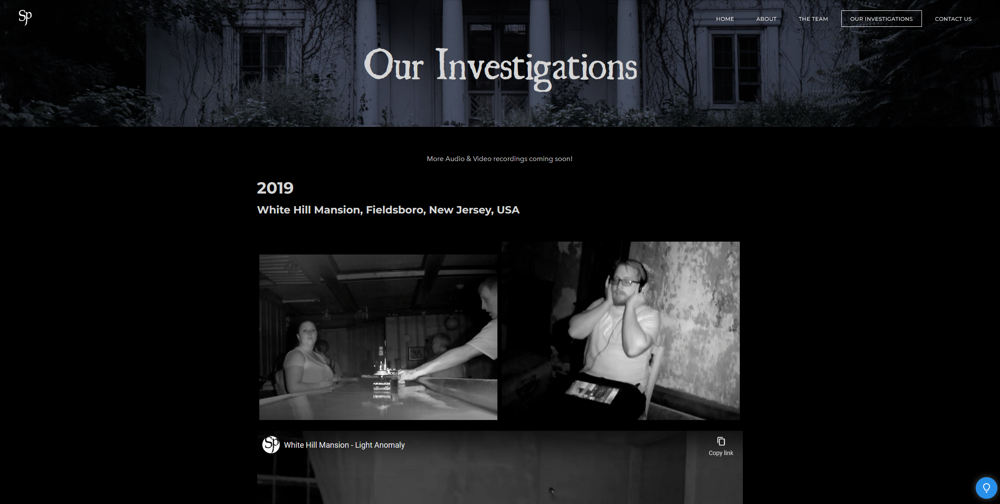

# Skylands Paranormal New Jersey Website

Originally designed via [Weebly](https://www.weebly.com/), this project aims to take it to the next level and build it from "scratch" via [React](https://reactjs.org/) and [Remix](https://github.com/remix-run/remix).

## Technologies

-   DOM with React
-   Ops via Remix
-   Photos from Unsplash and team-sourced
-   Styling with SCSS
-   Code formatting with Prettier
-   Linting with ESLint
-   Static Types with TypeScript
-   Hosting with Fly.io

## Sitemap

## Designs

### Home

### About

### The Team

### Our Cases

### Resources

### Contact

